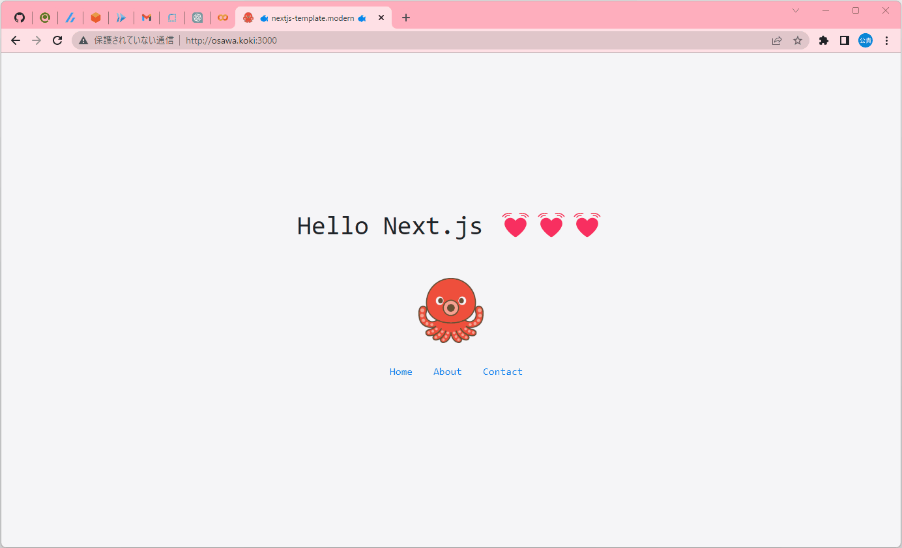

# aws-s3_workflow

🎍🎍🎍 AWS S3をTerraformとGitHub ActionsでCI/CDに載せるサンプルプロジェクトです。  

  

## イロイロ設定

GitHubのシークレットに以下の値を設定してください。  

| シークレット名 | 説明 |
| --- | --- |
| AWS_ACCESS_KEY_ID | AWSのアクセスキー |
| AWS_SECRET_ACCESS_KEY | AWSのシークレットキー |
| AWS_REGION | AWSのリージョン |

`terraform.tfvars.example`を`terraform.tfvars`にリネームして、値を設定してください。  

## 実行方法

TerraformでAWSのリソースを作成します。  

```shell
terraform init
terraform plan
terraform apply
```

GitHub ActionsでS3にデプロイします。  
mainブランチにpushすると自動で実行されます。  

## 参考資料

- [Terraform(S3)](https://registry.terraform.io/providers/hashicorp/aws/latest/docs/resources/s3_bucket)
- [GitHub ActionsでウェブサイトをAmazon S3にデプロイする(classmethod)](https://dev.classmethod.jp/articles/deploy-web-site-with-github-actions/)
- [S3の公開(AWS)](https://docs.aws.amazon.com/ja_jp/AmazonS3/latest/userguide/HostingWebsiteOnS3Setup.html)
- [静的ウェブサイトホスティング](https://docs.aws.amazon.com/AmazonS3/latest/userguide/WebsiteHosting.html)
